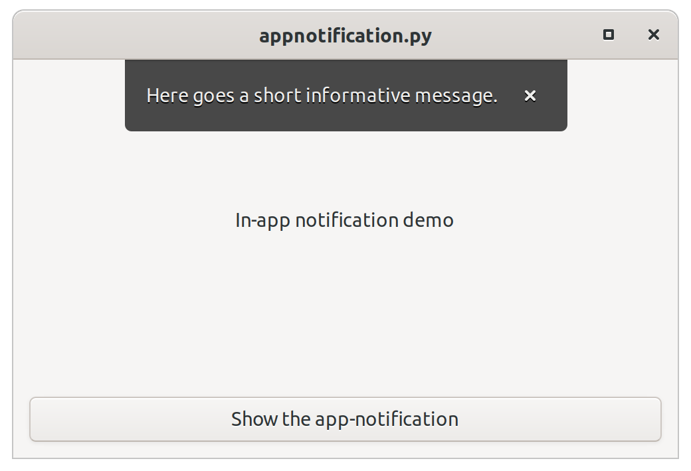

# GTK in-app notification demo

This repo contains a small demo _in-app notifications_ for [GTK](https://gtk.org). In-app notifications [are part of GTK](https://developer.gnome.org/hig/stable/in-app-notifications.html.en),
but there's no special widget. Instead it can be created by combining existing widgets and applying style classes.

## Background
When you look at applications like GNOME [Files](https://wiki.gnome.org/action/show/Apps/Files) and [Geary](https://wiki.gnome.org/Apps/Geary),
it shows a nice small notification overlay at the top of the window every now and then.

There is no special widget for such a notification bar. When I searched for this notification bar I found exactly one match: [a post on Stack Overflow](https://stackoverflow.com/questions/45431512/gtk-in-app-notifications-api-referece). Where else.

That's not a lot. Geary is not the only application to implement one.

## The basics

The basic idea is to use a [Gtk.Overlay](https://lazka.github.io/pgi-docs/index.html#Gtk-3.0/classes/Overlay.html).
Add the main content to the base layer and add a second layer with a [Gtk.Revealer](https://lazka.github.io/pgi-docs/index.html#Gtk-3.0/classes/Revealer.html).
To this revealer, you add a [Gtk.Box](https://lazka.github.io/pgi-docs/index.html#Gtk-3.0/classes/Box.html),
or a [Gtk.Frame](https://lazka.github.io/pgi-docs/index.html#Gtk-3.0/classes/Frame.html), and apply a class `app-notification` to it. Add a label and a button and you're done. The icons used are "symbolic" icons.
